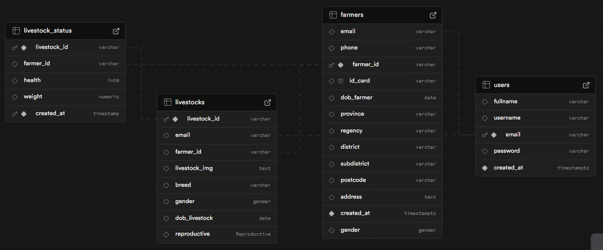
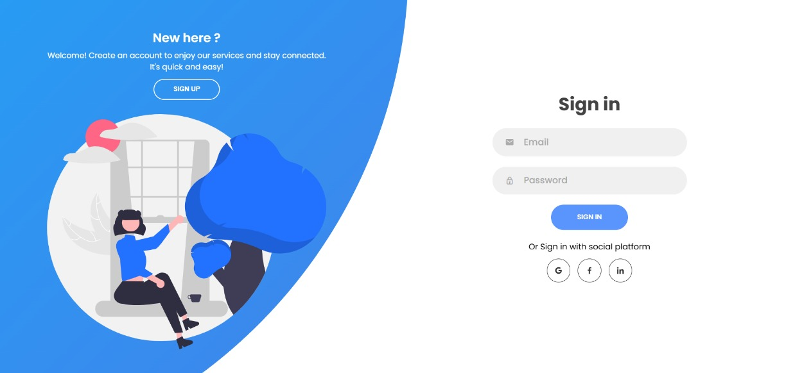
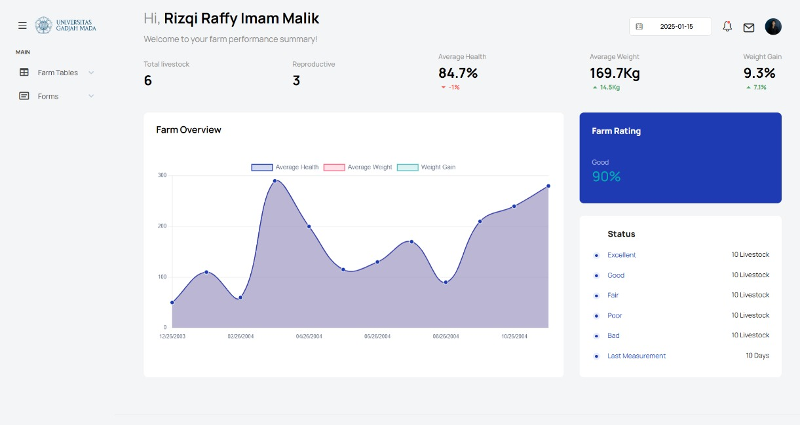
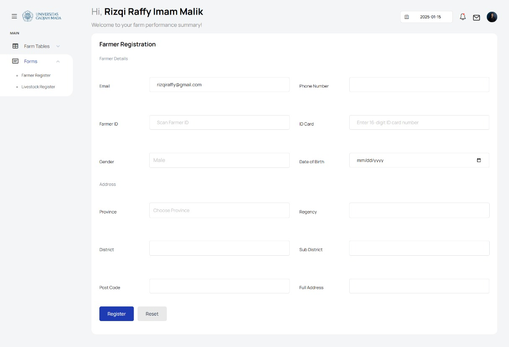
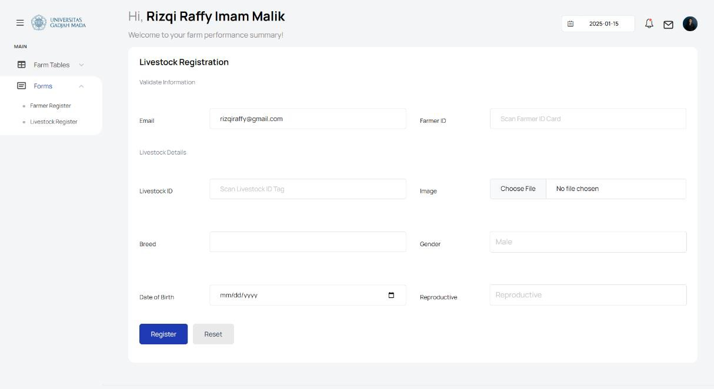
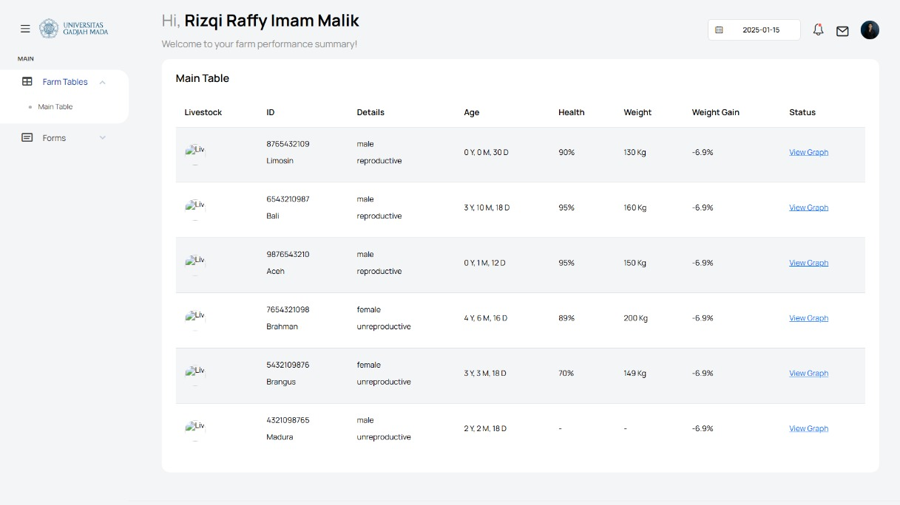

<h1 align="center">🐄 IoT Livestock Monitoring System</h1>

  <strong>Full Stack Engineer – AMX UAV Technologies (Yogyakarta, Indonesia)</strong> 
  <em>August 2024 – January 2025</em>

---

## 🔍 Overview  
This project is a **web-based IoT livestock monitoring and management platform** built using **PHP**, **Supabase (PostgreSQL)**, and **IoT hardware** such as **ESP32**, **RFID**, and **Load Cell** sensors.  
It enables real-time livestock weight and health tracking, secure farmer registration, and interactive data visualization through a responsive dashboard.

---

## ⚙️ Tech Stack  
| Layer | Technology |
|:------|:------------|
| **Backend** | PHP (PDO PostgreSQL) |
| **Database** | Supabase |
| **Frontend** | HTML, CSS, JavaScript, Chart.js |
| **IoT Hardware** | ESP32, Load Cell, RFID Module |

---

## 🗄️ Database Structure  
The Supabase schema links four main tables using **primary** and **foreign keys** to maintain relational integrity and data verification:

- **users** – stores base user information (`email` as PK)  
- **farmers** – verified farmer data (`farmer_id` as PK, `email` as FK)  
- **livestocks** – records livestock information (`livestock_id` as PK, linked to farmer)  
- **livestock_status** – logs livestock weight and health data (`livestock_id`, `farmer_id` as FK)

  

---

## 💻 Key Features  
- 🔒 Secure user and farmer registration  
- 🌐 IoT data integration with Supabase backend  
- 📊 Real-time livestock health and weight monitoring  
- 📈 Dynamic data visualization using **Chart.js**  
- 🏷️ RFID-based identification for livestock and farmers  

---

## 🧩 System Interfaces  

| Page | Preview |
|------|----------|
| **Sign Up** |  |
| **Sign In** |  |
| **Dashboard** |  |
| **Farmer Registration Form** |  |
| **Livestock Registration Form** |  |
| **Data Table** |  |

---

## 🚀 Future Enhancements  
- Real-time IoT dashboard synchronization  
- Predictive livestock growth analytics  
- Enhanced UI/UX responsiveness for mobile and tablet devices  

---

## 🧾 License  
This project is released under the **MIT License**.  
See the [LICENSE](./LICENSE) file for more details.

---

  <strong>Developed by</strong> 
  <b>Rizqi Raffy Imam Malik</b> 
  <em>Full Stack Engineer @ AMX UAV Technologies</em> 
  📍 Yogyakarta, Indonesia  
   📧 <a href="mailto:rizqiraffy@gmail.com">rizqiraffy@gmail.com</a>  
   🔗 <a href="https://www.linkedin.com/in/rizqiraffy/">linkedin.com/in/rizqiraffy</a>

